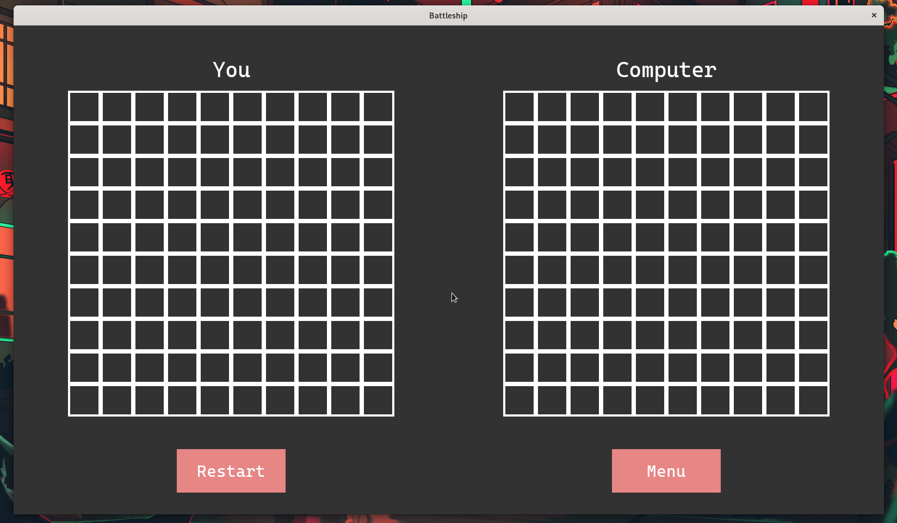

# Battleship

Project for Python class at Cracow University of Science



### Installation

On linux/macos zsh

```shell
git clone https://github.com/szymonszoldra/battleship.git
cd battleship
virtualenv -p python3 venv
source venv/bin/activate
pip install -r requirements.txt
```

On windows

```shell
git clone https://github.com/szymonszoldra/battleship.git
cd battleship
py -3 -m venv venv
venv\Scripts\activate
pip install -r requirements.txt
```

### Run
to run tests
```shell
python -m unittest -v
```
to play
```shell
python main.py
```